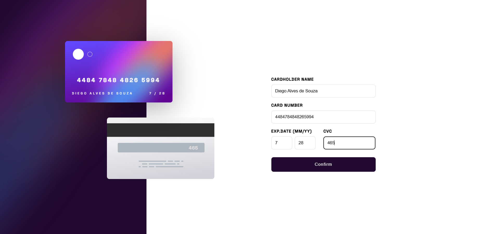

# Descrição

Este projeto foi desenvolvido como um desafio proposto pelo site Frontend Mentor. A solução foi implementada utilizando React e CSS puro. O objetivo foi reproduzir fielmente o design fornecido no desafio

# Link do desafio

[Interactive card](https://www.frontendmentor.io/challenges/interactive-card-details-form-XpS8cKZDWw)
